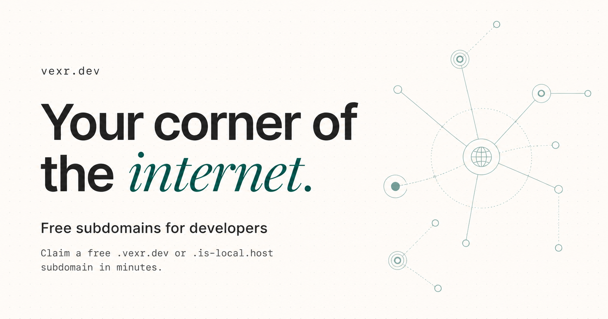

 
 

---

Free, developer-first `.vexr.dev` subdomains with custom DNS management, built on top of Cloudflare's global infrastructure.

No passwords, no cost, no friction. Just connect GitHub, star the repository, and direct traffic to your weekend projects in seconds.

---

## Features

- **Frictionless Auth**: Sign in securely using your GitHub account—no passwords to manage.
- **Custom DNS Management**: Manage `A`, `AAAA`, `CNAME`, `TXT`, and `MX` records with a pixel-brutalist developer-first dashboard.
- **Cloudflare Proxy Support**: Toggle Cloudflare's proxying (orange cloud) on or off for individual records dynamically.
- **Periodic Star Validation**: Subdomains remain active as long as you support the project with a repository star.
- **Responsive Design**: Manage your zones seamlessly from your phone, tablet, or desktop.

---

## How to Claim Your Domain

Here is a step-by-step walkthrough to get your project online.

### Step 1: Check Subdomain Availability

Go to the [vexr.dev Homepage](https://vexr.dev) and search for your project's desired name. The system checks against reserved domains and active registrations to ensure the name is available.

*Type your project name and click **Claim Now** to proceed.*

---

### Step 2: Connect GitHub & Support the Project

Authenticate with your GitHub account. To claim and maintain a subdomain, we ask for a repository star on [vexr-dev/vexr.dev](https://github.com/vexr-dev/vexr.dev) to keep the project sustainable.

*Click **Verify Star** to check your star status.*

> [!IMPORTANT]
> **Star Verification Policy**
> A background worker runs every 12 hours. If you unstar the repository or revoke your token, your domain and its records on Cloudflare will be **temporarily deactivated** (DNS records are paused, not deleted). You can reactivate your domain instantly by visiting `/onboarding` and clicking **Verify Star** again.

---

### Step 3: Manage Your DNS Records

Once onboarding is complete, you will be redirected to the dashboard. Under the **DNS Management** tab, you can start pointing your subdomain to your servers (Vercel, Netlify, Render, AWS, VPS, etc.).

#### DNS Capabilities:
- **Proxy Toggle**: A click toggle button lets you enable or disable Cloudflare's edge proxying.
- **MX Record Alert**: If configuring mail server records (`MX`), note that subdomains under `vexr.dev` cannot directly receive mail since mail providers do not support third-party subdomains. Please direct them to your own mail servers.
- **Limit**: Up to 5 DNS records can be registered per subdomain.

---

### Step 4: Deleting / Releasing Subdomains

If you no longer need your subdomain or want to register a different one, navigate to **Settings** and release the domain. This immediately removes all DNS configurations and frees up the subdomain for other developers.

---

## Developer Notice

Please play nice. Do not use your subdomain for:
- Phishing, malware, or host malicious content.
- Unsolicited spam campaigns (emails sent via custom subdomains).
- Domain squatting on highly recognizable brand names.

Enjoy your corner of the internet! 🚀
